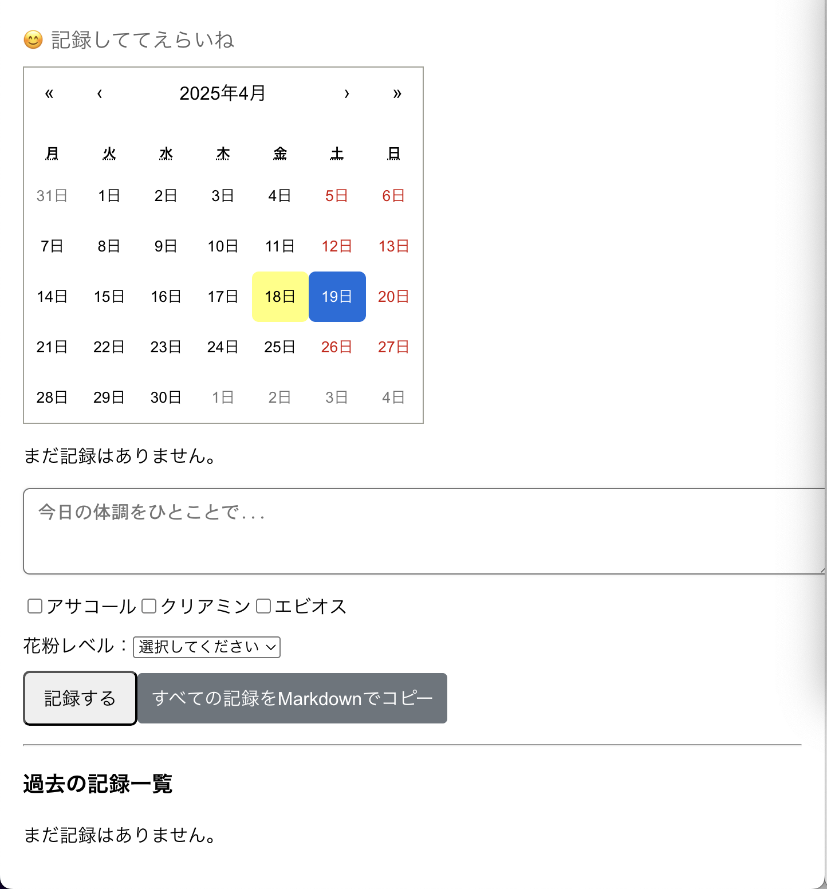
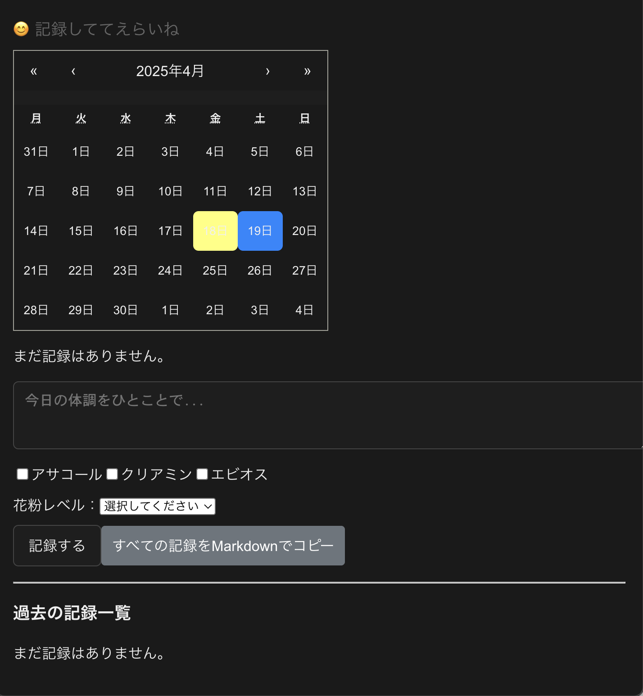

# Health Log App


## 🩺 アプリ概要

「Health Log App」は、毎日の体調・服薬・花粉レベルなどを記録し、  
Markdown形式での振り返りや共有ができるシンプルなログアプリです。  
自分の体調の変化を可視化し、再燃や不調を早期に察知することを目的としています。

## 🚀 アプリURL（Vercel）

▶️ [https://health-log-app.vercel.app](https://health-log-app.vercel.app)

## 📸 スクリーンショット

<p align="center">
  
  
</p>

## 🔧 セットアップ手順

```bash
git clone https://github.com/ksk3gogodayo/health-log-app.git
cd health-log-app
npm install

.env ファイルをルートディレクトリに作成し、Firebaseの設定値を記述してください：
REACT_APP_FIREBASE_API_KEY=...
REACT_APP_FIREBASE_AUTH_DOMAIN=...
REACT_APP_FIREBASE_PROJECT_ID=...
REACT_APP_FIREBASE_STORAGE_BUCKET=...
REACT_APP_FIREBASE_MESSAGING_SENDER_ID=...
REACT_APP_FIREBASE_APP_ID=...

起動：
npm start

## 🛠 使用技術

- React（Create React App）
- TypeScript
- Firebase Firestore
- Vercel（ホスティング）
- React Calendar
- Markdown変換（手動生成）

## 📝 機能一覧（今後追記）

- 日付ごとの体調メモ入力
- 薬チェック機能（アサコール・クリアミン・エビオス）
- 花粉レベル入力
- Firestore保存・取得・更新・削除
- Markdownでコピー機能
- モバイル対応（iOS調整含む）

---

## 🛡 セキュリティについて（Firestoreのルール）

現在は個人利用前提で Firestore Security Rules を許可（true）に設定しています。  
今後、他者との共有や公開を検討する場合は、Firebase Authentication の導入と  
ユーザーごとの読み書き制限ルールの実装が必要です。

---

## 🧳 バックアップ・データ管理構想

- ログデータを Markdown / JSON 形式で出力（現在はMarkdownコピー機能あり）
- ローカル保存と Firestore 保存の切替（将来的にオプション化も検討）
- Obsidian やお薬手帳アプリ（例：Point）との使い分け・連携を意識

---

## 🌈 将来の展望・追加予定機能

- 「🌟 今日のひとこと」ランダム表示（実装済み）
- カレンダーで日付ごとの絞り込み（実装済み）
- ダークモード対応（実装済み）
- グラフ化による体調変化の可視化
- PWA化対応（ホーム画面追加やオフライン使用）
- 限定リンク共有による「家族に見せられる記録」対応
- Firestore以外のストレージ選択肢（将来的な有料プラン回避に向けて）

---

## 🗒 その他メモ

- `.env` は `.gitignore` により Git に含まれません（安全性保持）
- Firebase の設定値は Vercel 上の環境変数として個別に登録
- GitHub上のコードには Firebase 情報や個人データは含まれません

⸻

## 📄 ライセンス

このプロジェクトは [MIT ライセンス](./LICENSE) のもとで公開されています。

---

## 🙋‍♂️ 作者

**けい**

GitHub → [@ksk3gogodayo](https://github.com/ksk3gogodayo)  
X（旧Twitter）→ [@ksk3gogodayo](https://twitter.com/ksk3gogodayo)  

※Xは現在あまり稼働していませんが、お気軽にどうぞ！